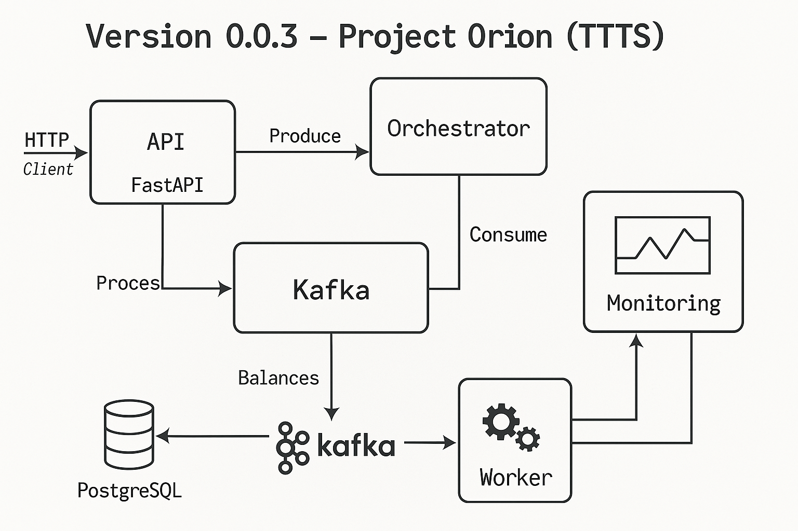

🛰️ Версия 0.0.3 — Project Orion (TTTS)

transaction-system/
├── api/
│   └── main.py  # FastAPI endpoint
├── orchestrator/
│   └── worker_manager.py  # координация очередей
├── worker/
│   └── consumer.py  # обработка событий Kafka
├── common/
│   └── db.py, models.py, kafka.py
├── helm/  # чарты для Kubernetes
│   └── values.yaml, templates/
├── prometheus/
│   └── prometheus.yml
├── elastic/
│   ├── logstash.conf
│   └── kibana.yml
└── docker-compose.yml  # для локальной разработки

